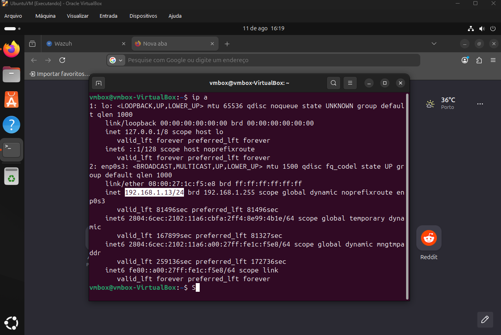
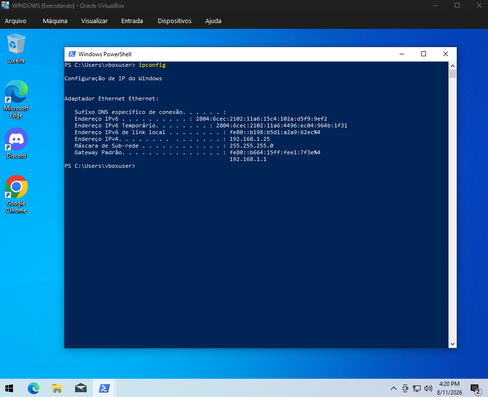
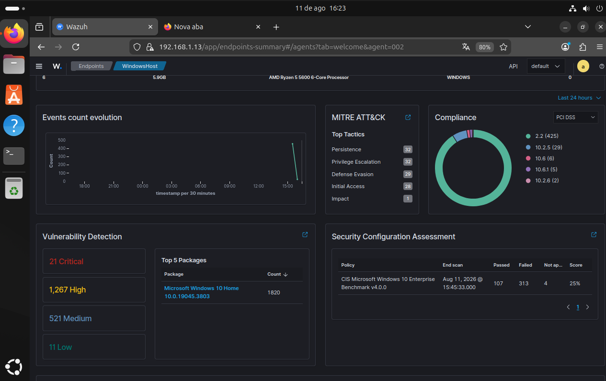
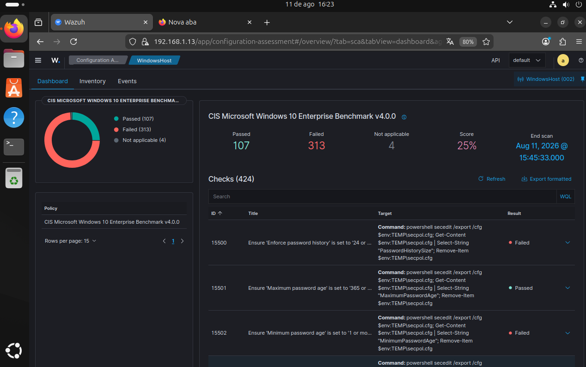
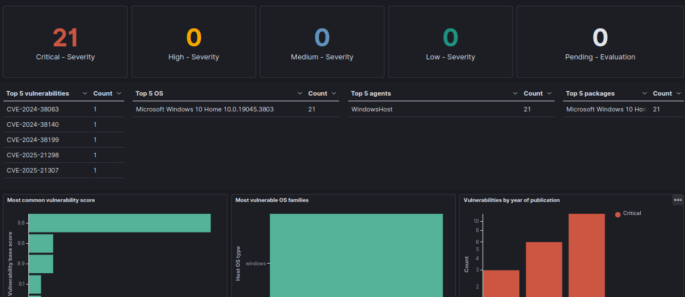
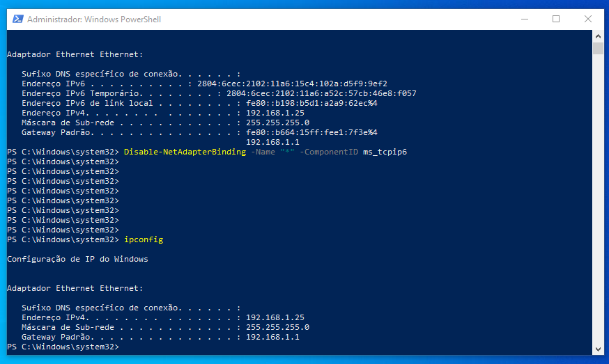
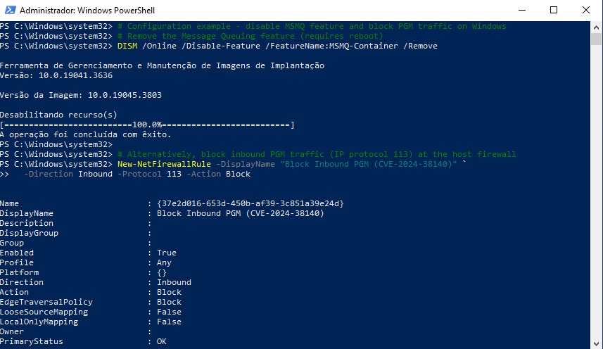
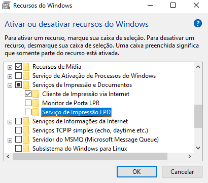

# Laboratório SIEM com Wazuh

Eu organizei um laboratório de SIEM usando o Wazuh. Para isso, usei duas máquinas virtuais:

- Ubuntu: hospedando o Wazuh (manager);
- Windows 10: atuando como agente;

O propósito desse laboratório é obter experiência prática com ferramentas de SIEM no geral. Desde a instalação até a análise de eventos de segurança, buscando entender detalhadamente as vulnerabilidades.

---

## O que é um SIEM, XDR? O que é o Wazuh?

Uma ferramenta **SIEM** (_Security Information and Event Management_), ou então, _Gestão de Informações e Eventos de Segurança_; se trata de uma aplicação que coleta e analisa logs para monitorar atividades críticas em uma organização, com rastreamento de eventos de segurança em tempo real. Esses dados permitem identificar e investigar ameaças, riscos e vulnerabilidades. Através de dashboards, equipes de segurança conseguem gerenciar e monitorar essas informações, ainda que, atualmente, a análise dos eventos exija interação humana.

O **XDR**, *Extended detection and response*, ou, *Detecção e resposta estendida* coleta e correlaciona automaticamente dados entre várias camadas de segurança: e-mail, Endpoint, servidor, workload em nuvem e rede. Isso permite uma detecção mais rápida de ameaças e melhor investigação e tempos de resposta por meio de análises de segurança.

O **Wazuh** é uma plataforma de segurança gratuita e de código aberto, que **unifica SIEM e XDR em uma única solução.** Ele monitora endpoints, redes e ambientes em nuvem para detectar ameaças, responder a incidentes e garantir conformidade, sendo hoje uma das ferramentas de cibersegurança open-source mais adotadas no mundo, usada por empresas de todos os portes.

## Máquinas Virtuais usadas no processo:

_VM do Ubuntu com seu IP:_
<figure>
  
</figure>

_VM do Windows com seu IP:_
<figure>
  
</figure>

---

## Investigação

Assim que criei a máquina virtual do Ubuntu e instalei por meio do Quickstart na documentação do Wazuh, configurei um novo agente, que é a segunda máquina virtual usada no laboratório.
A seguir, o dashboard do endpoint.

Podemos perceber que há varias detecções de vulnerabilidades. Mas veremos primeiramente algo que o Wazuh cuidou de fazer como primeira instância, o scan do CIS Benchmark:

Nota-se que o scanning do CIS benchmark revelou que o agente possui um score aproximado de 25%.
Esse score está medindo a porcentagem de compliance que o endpoint teve.
É categórico que a instalação padrão do Windows não é suficiente para segurança.
Até mesmo nas versões atuais do Windows, pode ser descoberto vulnerabilidades em um sistema mal protegido.

Agora, iremos para a seção de Vulnerability Detection. De todas as 21 vulnerabilidades críticas, temos como as 5 maiores vulnerabilidades:

**As 5 maiores vulnerabilidades listadas pela Detecção de Vulnerabilidades são:**

- CVE-2024-38063
- CVE-2024-38140
- CVE-2024-38199
- CVE-2025-21298
- CVE-2025-21307

---

## Explicação das vulnerabilidades

1. [CVE-2024-38063](https://msrc.microsoft.com/update-guide/vulnerability/CVE-2024-38063)

Trata de uma vulnerabilidade de execução remota de código TCP/IP do Windows.

"Um invasor não autenticado poderia enviar repetidamente pacotes IPv6, que incluem pacotes especialmente criados, para uma máquina Windows, o que poderia permitir a execução remota de código.
A mitigação se refere a uma configuração, uma configuração comum ou uma prática recomendada geral, existindo em um estado padrão, que pode reduzir a severidade da exploração de uma vulnerabilidade."

Foi sugerido a desativação de endereços IPv6 no host como forma de mitigar a vulnerabilidade.

2. [CVE-2024-38140](https://msrc.microsoft.com/update-guide/vulnerability/CVE-2024-38140)

Vulnerabilidade de execução remota de código do RMCAST (_Reliable Multicast Transport Driver_) do Windows.

"Um invasor não autenticado pode explorar a vulnerabilidade enviando pacotes especialmente criados para um soquete aberto do PGM (Multicast geral pragmático) do Windows no servidor, sem qualquer interação do usuário."
Essa vulnerabilidade só pode ser explorada se houver um programa escutando em uma porta PGM (Multicast geral pragmático). Se o PGM estiver instalado ou habilitado, mas nenhum programa estiver escutando ativamente como receptor, essa vulnerabilidade não poderá ser explorada. O PGM não autentica solicitações, portanto é recomendável proteger o acesso a todas as portas abertas no nível da rede (por exemplo, com um firewall)

Portanto, a mitigação recomendada é: não expor um receptor PGM à internet pública.

3. [CVE-2024-38199](https://www.cve.org/CVERecord?id=CVE-2024-38199)

Vulnerabilidade de execução remota de código do serviço LPD (_Line Printer Daemon_) do Windows

Um invasor não autenticado pode enviar uma tarefa de impressão especialmente criada para um serviço LPD (Line Printer Daemon) do Windows vulnerável compartilhado em uma rede. A exploração bem-sucedida pode resultar na execução remota de código no servidor.

Para mitigar a vulnerabilidade, basta não instalar ou habilitar o serviço LPD (Line Printer Daemon). O LPD não é instalado ou habilitado nos sistemas por padrão, o serviço LPD (Line Printer Daemon) foi anunciado como obsoleto no Windows Server 2012.

4. [CVE-2025-21298](https://www.cve.org/CVERecord?id=CVE-2025-21298)

Vulnerabilidade de execução remota de código no Windows OLE (_Vinculação e incorporação de objeto_, é uma tecnologia que permite incorporar e vincular documentos e outros objetos.).

"Em um cenário de ataque por email, um invasor pode explorar a vulnerabilidade enviando um email especialmente criado para a vítima. A exploração da vulnerabilidade pode envolver uma vítima que abre um email especialmente criado com uma versão afetada do software Microsoft Outlook ou o aplicativo Outlook da vítima que exibe um email especialmente criado. Isso pode fazer com que o invasor execute um código remoto no computador da vítima."

Para se proteger contra essa vulnerabilidade, é recomendado ler as mensagens de email em formato de texto sem formatação. No caso acima, configure o Microsoft Outlook.

5. [CVE-2025-21307](https://www.cve.org/CVERecord?id=CVE-2025-21307)

Vulnerabilidade de execução remota de código do RMCAST (Reliable Multicast Transport Driver) do Windows

Essa vulnerabilidade expõe o mesmo problema encontrado na vulnerabilidade CVE-2024-38140. Ambos os problemas estão relacionados a mesma vulnerabilidade, mas são diferentes pois o CVE-2024-38140 lida com um serviço
do Windows chamado MSMQ, que depende do PGM. A falha CVE-2025-21307 é uma vulnerabilidade direta do PGM.

---

## Mitigando Vulnerabilidades

Essas vulnerabilidades devem ser corrigidas por meio do hardening no sistema operacional. Não basta somente atualizações do sistema operacional, há a necessidade de uma boa configuração do sistema.

Idealmente, atualizar para o Windows 11 e realizar com determinada frequência atualizações de segurança é uma boa prática. Contudo, isso não é viável para algumas empresas que ainda mantêm essa versão.

Para resolver as 5 vulnerabilidades críticas informadas pelo Wazuh, faremos os seguintes passos:

Desabilitar o IPv6 do agente:

Bloqueando o serviço MSMQ e o tráfego de rede pelo PGM:

Desabilitando o serviço de LPD:

---

## Conclusão
